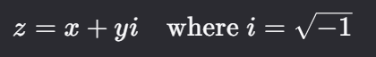
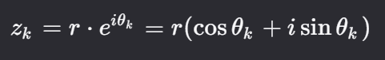
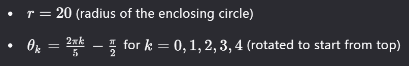
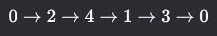
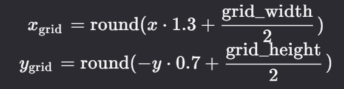
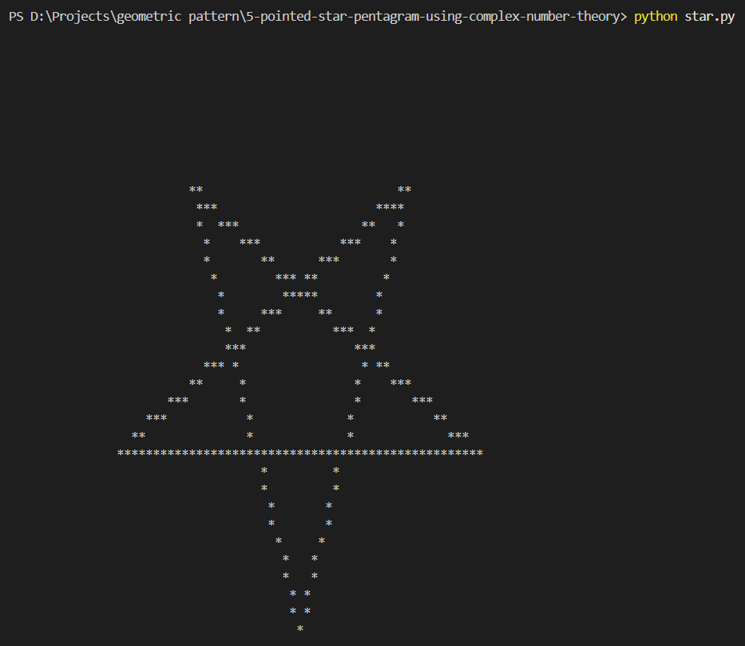

# 🌟 5-Pointed Star Pattern Generation Using Complex Numbers  
## A Mathematical and Computational Approach  

### Abstract  
This project presents a method to generate a **perfect 5-pointed star (pentagram)** using **complex number theory** and **ASCII art**. By leveraging the geometric properties of complex numbers on the unit circle, we compute vertex positions and connect them with Bresenham’s line algorithm to produce a symmetric star pattern in the terminal. This approach demonstrates the application of abstract mathematics to visual pattern generation.

---

## 🧮 1. Mathematical Foundations  

### 1.1 Complex Numbers and the Unit Circle  
A complex number *Z* is defined as:  
 
Points on the unit circle in the complex plane can be expressed as:  
 
For a 5-pointed star:  


### 1.2 Pentagram Geometry  
The pentagram is constructed by connecting every second vertex of a regular pentagon. The connection order is:  
 
This creates intersecting chords that form the star’s internal triangles.

---

## 🛠️ 2. Implementation Details  

### 2.1 Coordinate Conversion  
To map complex coordinates to a 2D ASCII grid:  
 
- **X-axis scaling (1.3):** Prevents horizontal compression.  
- **Y-axis scaling (0.7):** Compensates for taller ASCII characters.  

### 2.2 Line Drawing Algorithm  
Bresenham’s Line Algorithm is used to draw smooth lines between vertices:  
```python
def draw_line(x0, y0, x1, y1):
    dx = abs(x1 - x0)
    dy = abs(y1 - y0)
    sx = 1 if x0 < x1 else -1
    sy = 1 if y0 < y1 else -1
    err = dx - dy

    while True:
        grid[y0][x0] = '*'  # Plot pixel
        if x0 == x1 and y0 == y1:
            break
        e2 = 2 * err
        if e2 > -dy:
            err -= dy
            x0 += sx
        if e2 < dx:
            err += dx
            y0 += sy
```

---

## 🖼️ 3. Results  

### 3.1 Final Output  


### 3.2 Key Enhancements  
| Feature | Description |
|--------|-------------|
| **Symmetry** | Perfectly balanced star using complex math. |
| **Aspect Ratio** | Y-axis scaled by `0.7` to match ASCII character height. |
| **Line Smoothing** | Bresenham’s algorithm ensures continuous lines. |

---

## 📌 4. Discussion  

### 4.1 Advantages of Complex Numbers  
- **Rotation**: Multiplying by $ e^{i\theta} $ rotates points in 2D space.  
- **Compactness**: Complex arithmetic simplifies coordinate transformations.  

### 4.2 Limitations  
- **Resolution**: ASCII art is inherently low-resolution.  
- **Aspect Ratio**: Terminal fonts distort vertical/horizontal proportions.  

---

## 🚀 5. Conclusion  

This project demonstrates how abstract mathematical concepts (complex numbers, polar coordinates) can be applied to generate visually appealing patterns. By combining geometric theory with computational algorithms, we achieve a precise and symmetric 5-pointed star in ASCII format.

---

## 📚 6. References  
1. Needham, T. (1997). *Visual Complex Analysis*. Oxford University Press.  
2. Bresenham, J.E. (1965). *Algorithm for Computer Control of a Digital Plotter*. IBM Systems Journal.  
3. Wikipedia: [Pentagram](https://en.wikipedia.org/wiki/Pentagram), [Complex Plane](https://en.wikipedia.org/wiki/Complex_plane).  

